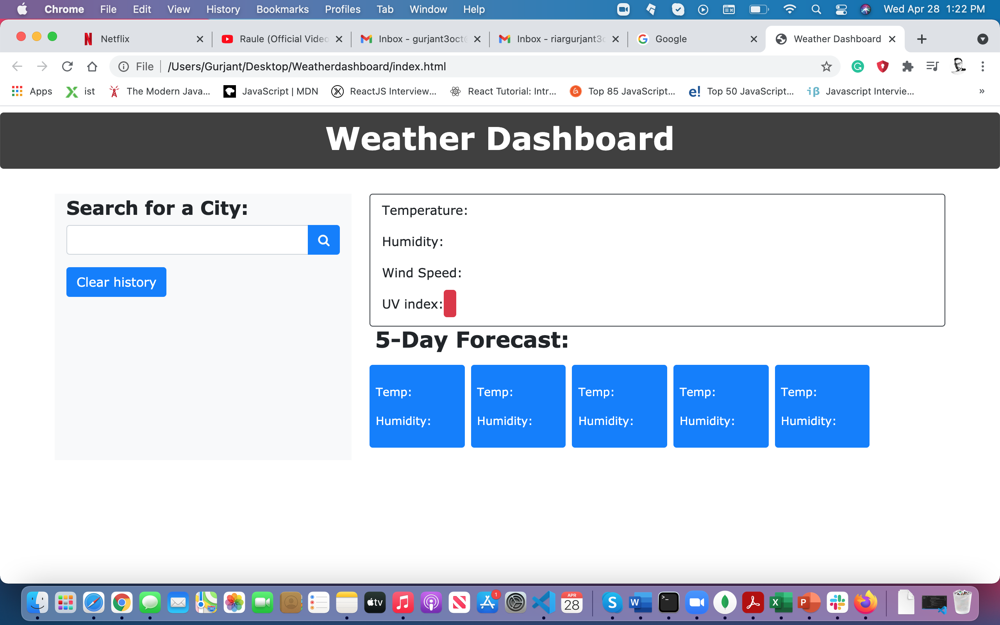
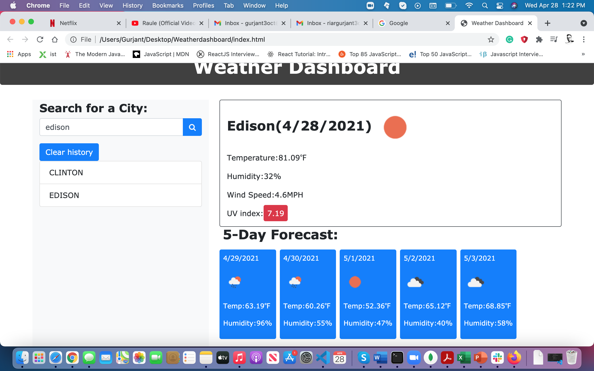

# Weather-Dashboard
## Description
Weather-Dashboard is an application to find a weather condition of a given city both the current and 5-Days forecast at the same time.
The server-side API used to get response data object is retrieved from the Open Weather APi.
The current weather section is including the following weather characters and date.
* City, Date, Icon-image
* Temperature
* Humidity
* Wind Speed
* UV index
The 5-days weather forecast also displays below the current weather conditions section and it includes the following information for each day:
* Date
* Icon image
* Temperature
* Humidity
The local storage is used here to store the previous search city and display them to the user in the left side of the page under the list group. The user can also clear the search history by clicking the clear history button.
If the user wants to see the past search city weather condition again, just click the list group item cities under the clear history button.

### How:
* First when the user opens the page, the “loadlastCity” function is fired up which is responsible for fetching the stored cities from the local storage and  the “addToList” function is called to display the cities in the search history . The last searched city is then pass as a parameter in the “currentWeather” function and run the function for that city.
* currentWeather" function is passed the city as an argument to show the weather information about that city. Ajax call is made to the Open Weather API, by including the city and the API Key in the search query.  If the call is a success than the weather information will be returned in "response” data object. 
* "UVIndex" function is called with coordinate information and it returns the UV Index of the city. To fetch UV, index another AJAX call is made in the "UVIndex" function by including the latitude and longitude information in the query URL. And uv index for that city is shown on the page. 
* "forecast" function is called with the city id. When the ajax, call was success (which is determined by the code 200), the cities will be fetched from local storage. If there are no entries in the local storage, the city will be stored in the storage and also will be shown on the page where the search history is displayed. If there are entries in the storage, by using "find" function, we will search the entries from the storage to see if the city exists; if it exists, to prevent double entry, it won't be added to the storage or the page. If it does not previously searched, then it will be added to the storage and the page.
* Finally when the user enters the city name  in the input box and press search button, “displayWeather” function will be fired up and current weather function will be call to display the current and 5-days forecast weather condition on the page.

# 

# 

# 

# 

  ## Contributors
[Gurjant Riarl](https://github.com/GurjantRiar/Weatherdashboard)

# 
## Built With:
[Visual Studio](https://visualstudio.microsoft.com/)

[CSS](https://www.w3.org/TR/CSS/#css)

[JavaScript](https://javascript.info/)
# 
## Links:
[Email](pratikpatel_85@yahoo.com)

[Github Profile](https://github.com/GurjantRiar/
)

